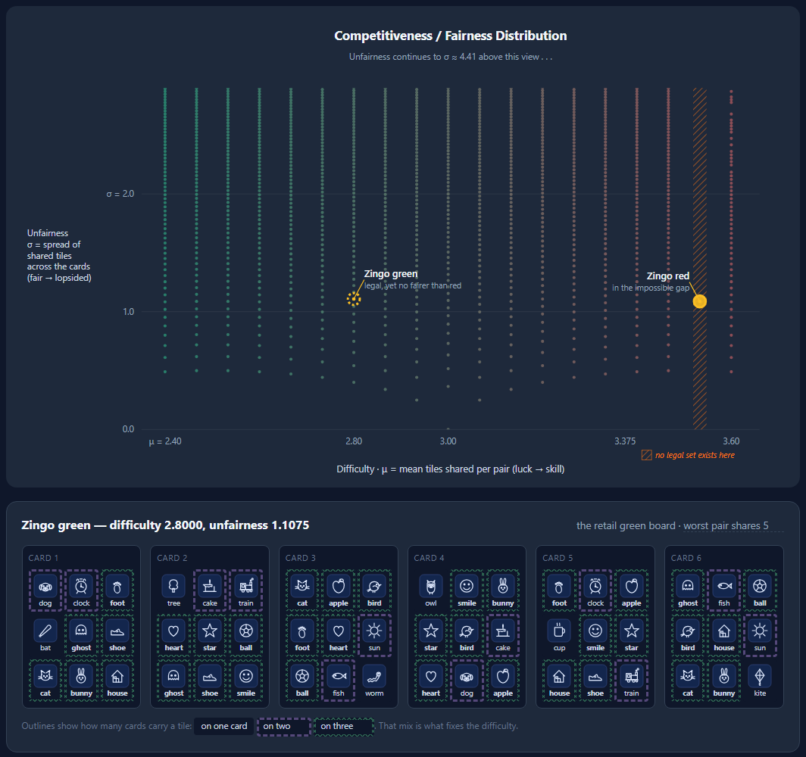

# Evaluating Zingo Fairness

[](https://github.com/timteachesmath/zingo/actions/workflows/ci.yml)

**Live page: [timteachesmath.github.io/zingo](https://timteachesmath.github.io/zingo/)**



An analysis of the children's tile game **Zingo!** (ThinkFun), built as an
interactive chart of every six-card set the game's 72 tiles can support.

## Findings

**The retail red set sits at a difficulty no legal set can reach.** It prints
five images on four cards each, but the game has only three copies of each
image. At a six-player table, at least two players (and as many as five) can
never finish their cards, whatever order the tiles come out in.

**The retail green set is not fairer than red.** By the standard deviation of
shared images across card pairs, green scores 1.1075 and red 1.0873. The "easy"
side is slightly more lopsided. The two sides differ in difficulty and in
whether the tiles can supply them, not in how evenly they treat players.

**Much fairer sets exist.** At green's own difficulty a set exists with an
unfairness of 0.40, almost three times fairer, and the page shows you one.

## Frontend

- **No framework.** Strict TypeScript, Vite and hand-built SVG. About 15 KB of
  the 180 KB bundle is code; the rest is the precomputed data.
- **Nearest-point hit testing.** The chart has 1,728 dots, so instead of giving
  each one a click target, the pointer selects whichever dot is closest on
  screen. Hover previews it, click pins it, and the arrow keys move between
  dots.
- **Touch.** On a phone, Chromium moves taps on tiny SVG shapes to the nearest
  element it thinks is clickable. The retail markers are therefore hit-tested
  by coordinate, weighed against the nearest dot so neither hides the other.
- **Card viewer.** Each dot lists the tile mixes that reach it, and any of them
  opens an example set, drawn as six cards with the real tile art. Outlines
  show how many cards share each tile, and hover, click or a hotkey (`2`, `3`,
  `W`) highlights one kind.
- **Shared design system.** Colours, type and components come from a
  stylesheet shared with the rest of
  [timteachesmath.github.io](https://timteachesmath.github.io); this page's own
  classes are prefixed `zg-` so they can't collide with it.
- **Checked in CI.** GitHub Actions runs the type check, the tests and the
  build on every push.

## What is proven

- **Proven.** The fairest possible set at each difficulty has a closed-form
  bound (split the shared images across the 15 pairs as evenly as whole
  numbers allow), and a constructed set reaches that bound in **all 18
  difficulty levels**. Nothing can sit below that line. Difficulty takes only
  those 18 values, and red's value (a total of 53 shared images) is not one of
  them.
- **Proven, mix by mix.** Every set belongs to one of 37 tile mixes, and **all
  37 have now been enumerated exhaustively**. So the chart is a census, not a
  sample: a gap in it is a point no legal set can reach, and the highest
  unfairness, σ = 4.41, is a maximum rather than a best effort. The data records
  this as `ceilingExact: true`.

The chart began as a local search, which found 1,713 of the 1,728 points. The
enumeration added the last 15 and turned the rest from "found" into "proven".
That search is kept as an artifact in `reference/sample-search.ts`, and what it
reached is recorded per mix as `searchFound`, which the tests use to check the
enumeration never claims less than the search already demonstrated.

The enumeration itself is `reference/zingo.py`. `data/exhaustive.json` records
each mix's values with a board proving every one, and the test suite re-scores
all of them.

## Running it

```bash
npm install
npm run dev          # the page
npm test             # the test suite
npm run typecheck    # strict type check
npm run exhaustive   # rebuild data/scatter.json from data/exhaustive.json
```

If the folder is in a cloud-synced directory, keep `node_modules` out of the
sync.

## Project layout

- `src/lib/`: the analysis as small pure functions (overlaps and difficulty,
  fairness, tile supply, sheet parsing, and the frontier search). The page, the
  data scripts and the tests all use this code.
- `src/`: the page, meaning the chart (`plane.ts`) and the card viewer
  (`main.ts`).
- `scripts/`: `build-data.ts` turns the enumeration into the chart's data file;
  `exhaustive-data.ts` reads, writes and merges it.
- `data/`: the two retail card sheets, the enumeration (`exhaustive.json`), and
  the chart data built from it. See [data/README.md](data/README.md) for the
  formats.
- `docs/`: the algorithm specs and the screenshot above.
- `tests/`: every derived bound is an assertion. The suite decodes and
  re-scores **every** example set the page can show and checks it lands on
  the dot it belongs to, so a data error fails the build.
- `reference/`: the Python enumeration that proves each tile mix, the original
  local search kept as an artifact, and early design mock-ups.

## License

MIT. See [LICENSE](LICENSE).
